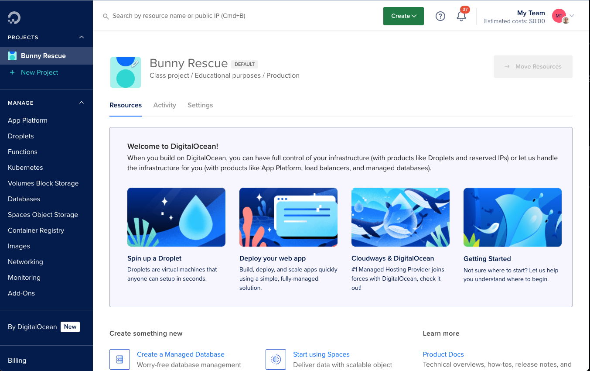

# bunnyrescue

Rescue virtual bunnies - fun for all the family!

Bunnyrescue was developed during Covid by Geoff House as a way to keep school children entertained during the Easter holidays.

## How to run a Bunny Rescue

To start with, you'll need to set this up on your own server. We recommend DigitalOcean, though you're free to choose.

You'll need to decide start and end dates, and communicate this to your users. Give them plenty of warning to sign up.

Usually you'll want to charge people a nominal fee to enter (and that bit's entirely up to you!). Peoples' email addresses are added to the system and they're ready to go. They'll get an email with a link for them to log in.

Before the start date, you'll need to print out a load of Bunnies (QR codes) and place them around your neighbourhood. You can do this yourself, or delegate to a team. The number of bunnies you want to place is entirely up to you - we generally hide 100-200 for 70 or 80 users.

People click on the link in their email, and choose a team name. Once logged in they can view a map of available bunnies, a list of which bunnies they've found, and a leaderboard showing all registered teams.

Once the event starts, in their own time they set off to find the bunnies. When they find one they scan it with a mobile phone (either in the app or using their own camera app) and log them as found. Each bunny can have a colour and an optional message which appears when scanned. There's no prizes for being the quickest - just for rescuing the most bunnies!

You can choose the level at which people win a small prize (by default 10) and then award larger prizes to the top finders. It's entirely up to you.

### Lessons we've learned

-   Rather than register multiple accounts per family, charge more and reward with more prizes, but use the same account
-   You'll need a lot of small prizes! If you're a charity, have a word with local supermarkets to see if they'll donate, otherwise you'll need to buy some!
-   Choose your prices carefully. Make sure it's not too cheap, but not so expensive that people expect a significant prize. We tend to charge a few pounds per child, with discounts for multiple children.
-   We recommend cutting each QR code out separately and laminating it around the edge. Otherwise it leaks and is unreadable.
-   You'll want a few admins to share the workload. They won't be able to find bunnies using their own account, but they can always set up a user account

## How it works

Bunnyrescue runs as a NodeJS backend, with a React-based frontend. If you have any problems, please raise them as issues in GitHub.

### Notifications

#### Emails

We use emails to communicate with users.
You'll need to register at SendGrid (https://sendgrid.com/). For the number of emails we're talking about you shouldn't have to spend any real money.

#### Admin

We support admin notifications via Slack, Pushover or Prowl. Slack is easiest and cheapest, and free for this sort of use.
Brace yourself - it's a lot of notifications!

# Installation

These instructions are for DigitalOcean. It's fairly straightforward to set it up for another provide if you know what you're doing.

## Create a VM

Go to https://cloud.digitalocean.com and set up a new account and team.



Create a new droplet in the appropriate region. We recommend:

-   Ubuntu 22.04 LTS
-   single shared CPU
-   1GB RAM
-   25GB SSD Disk

## Security

One this is done you'll need to restrict access to SSH/HTTP only.
Go to the network section in the droplet and edit the firewall to create some rules.

For good security you may wish to restrict SSH access to your own IP address, and HTTP/HTTPS to everywhere.

## Pre-requisites

You'll need:

-   git
-   docker engine: https://docs.docker.com/engine/install/

## Install bunny rescue app

Copy the following docker-compose.yml into a suitable folder (maybe `/opt/bunnyrescue`):

```
# NOTE: this docker-compose file is for production environments only

version: "3.0"

networks:
    bunnyrescue:
        driver: bridge

services:
    app:
        container_name: bunnyrescue
        image: ghcr.io/geoffhouse/bunnyrescue:latest
        restart: always
        volumes:
            - ./src:/home/node/bunnyrescue
            - ./src/templates:/home/node/bunnyrescue/templates
        environment:
            LOGFOLDER: logs
            LOGNAME: bunnyrescue
            CONSOLE_LOGLEVEL: info
            ENVIRONMENT: production
            SENDGRID_APIKEY: "your_sendgrid_api_key_here"
            FROM_EMAIL: "noreply@yoursendgridregisteredemail.domain"
            HOME_LAT: "51.000"
            HOME_LONG: "0.000"
            SERVER_NAME: "Your bunny rescue"
            SERVER_URL: "https://your.domain.name"
            PRIZE_LEVEL: 10
            START_TIME: "__START_JAVACRIPT_TIMESTAMP__"
            END_TIME: "__END_JAVACRIPT_TIMESTAMP__"
            ADMIN_EMAIL: "your@admin.email.address"
            PUSHOVER_APPTOKEN:
            PUSHOVER_USERKEY:
            PROWL_TOKEN:
            SLACK_WEBHOOK:
        networks:
            - bunnyrescue
        ports:
            - 4100:4100
            - 3000:3000
    mongo:
        image: mongo:latest
        restart: unless-stopped
        container_name: bunnyrescue-mongo
        networks:
            - bunnyrescue
        ports:
            - 27017:27017
```

Start up the app:

```
docker compose up -d
```

## Setup domain name

You'll need to use HTTPS to access this app. It's a good idea anyway, but it's the only way to be allowed to access the camera on a web browser.

Use your domain name to point an A record to your droplet IP address.

## Add NGINX proxy

This uses certbot to request an HTTPS certificate and forward all requests to the bunnyrescue app.

Clone this repository (maybe in `/opt`):

```
git clone https://github.com/wmnnd/nginx-certbot.git
```

Edit `nginx-certbot/init-letsencrypt.sh` and change domains and email addresses to suit.

Then edit `data/nginx/app.conf` and change domain names and the `proxy_pass` line to:

```
proxy_pass  http://YOURDOMAINNAMEHERE:3000;
```

Annoyingly this script needs `docker-compose` rather than the new `docker compose` (which you'll already have). Just install it anyway:

```
sudo apt install docker-compose
```

Lastly run the init script to fetch the certificate and run NGINX:

```
./init-letsencrypt.sh
```

Log in with your admin email address and start creating other users.
